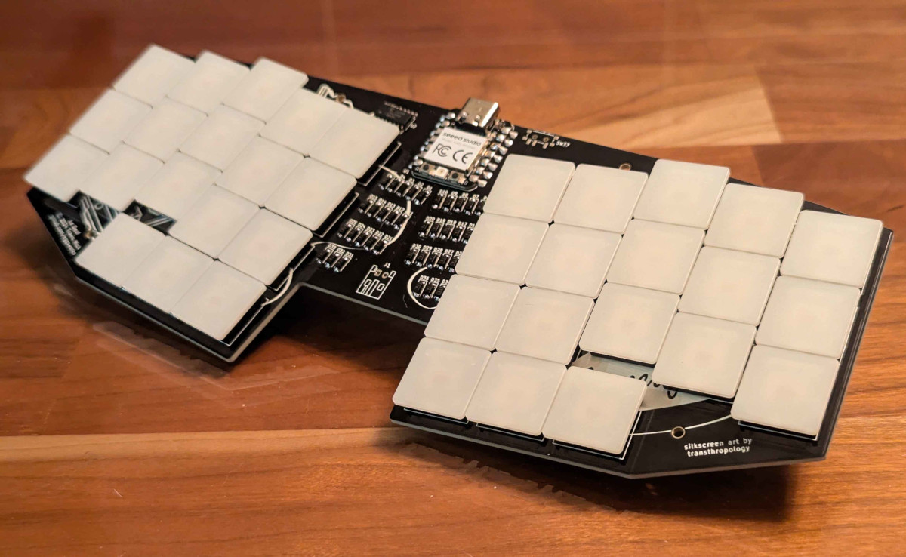
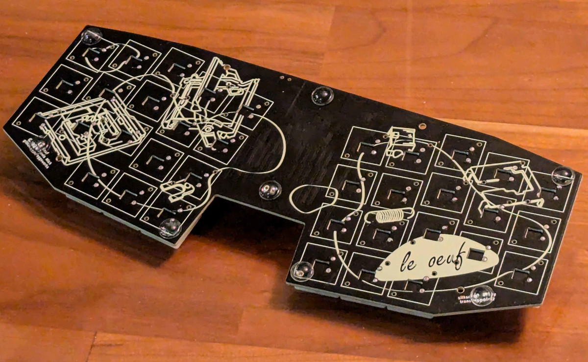

## Le Oeuf

A low profile (Kailh PG1425 "X Switch") keyboard inspired by Le Chiffre.

## Build guide (wired)

### BOM

- 36x 1N4148 diodes, SOD-123
- 36x Kailh PG1425
- 1x 74HC595D shift register, SOP-16
- 1x Seeed Studio XIAO RP2040

### Assembly

1. Solder all surface-mount components on the front of the board (diodes, shift register, XIAO)
2. Solder switches
3. Flash firmware and enjoy :D

## Build guide (wireless)

Coming soon :D

## Accessories

Case files coming soon :D

## Firmware

ZMK firmware available from [eggsworks/zmk-config](https://github.com/eggsworks/zmk-config/)

## License

This design is available under the terms of the [CERN-OHL-S](LICENSE).

## Acknowledgements

- MCU footprint derived from [marbastlib](https://github.com/ebastler/marbastlib/)
- Switch footprint derived from [kicad-footprint-kailh-pg1425-x-switch](https://github.com/shikamiya/kicad-footprint-kailh-pg1425-x-switch)
- Layout derived from ergogen source supplied for [le_capybara_keyboard](https://github.com/sporkus/le_capybara_keyboard)
- PCB art kindly provided by transthropology

