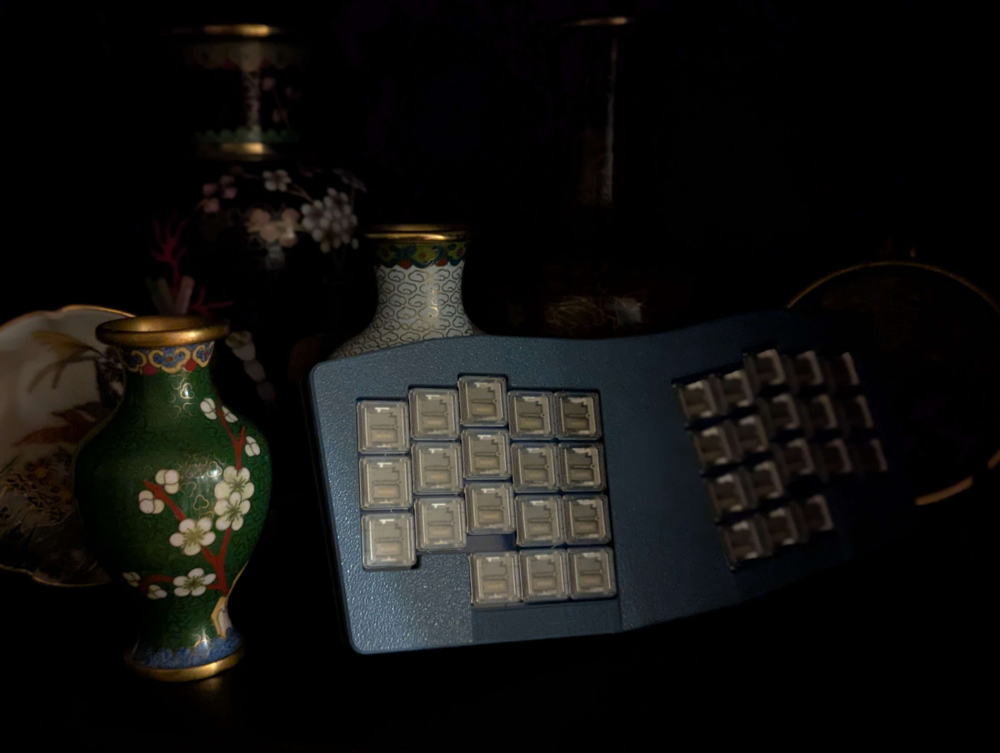
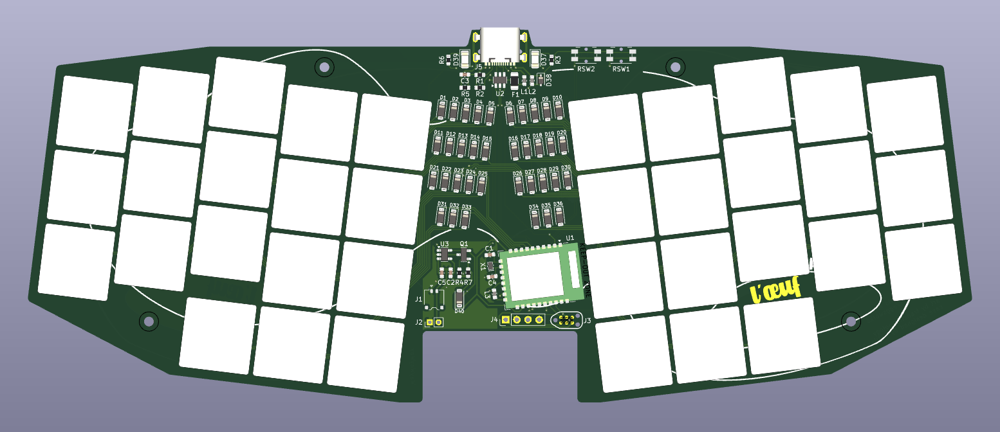

## L'oeuf

An ultra-low profile (Kailh PG1316S) keyboard inspired by Le Chiffre.

## PCB

L'oeuf is a semi-integrated PCB using an E73 BLE module. It is intended to be fully SMT assembled.

A mid-mount USB-C port and JST ACH battery connector keep the board as thin as possible.

## Firmware

ZMK firmware available from [eggsworks/zmk-config](https://github.com/eggsworks/zmk-config/)

## License

This design is available under the terms of the [CERN-OHL-S](LICENSE).

## Acknowledgements

- Inspired by the original [tominabox1/Le-Chiffre-Keyboard](https://github.com/tominabox1/Le-Chiffre-Keyboard/)
- E73 supporting circuitry derived from [krikun98/Willis](https://github.com/krikun98/Willis)
- MCU footprint derived from [ebastler/marbastlib](https://github.com/ebastler/marbastlib/)
- Switch footprint derived from [mikeholscher/zmk-config-mikefive](https://github.com/mikeholscher/zmk-config-mikefive/)
- Layout derived from ergogen source supplied for [sporkus/le_capybara_keyboard](https://github.com/sporkus/le_capybara_keyboard)
- PCB art kindly provided by transthropology
